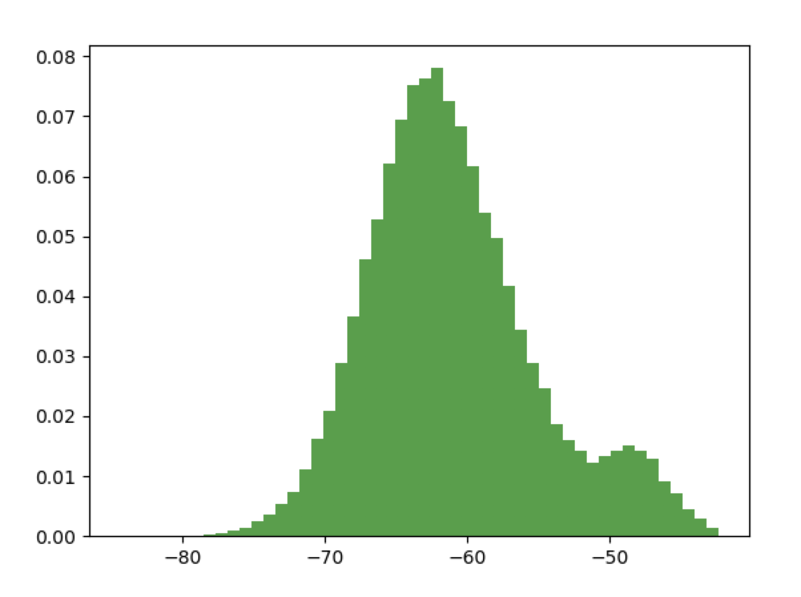
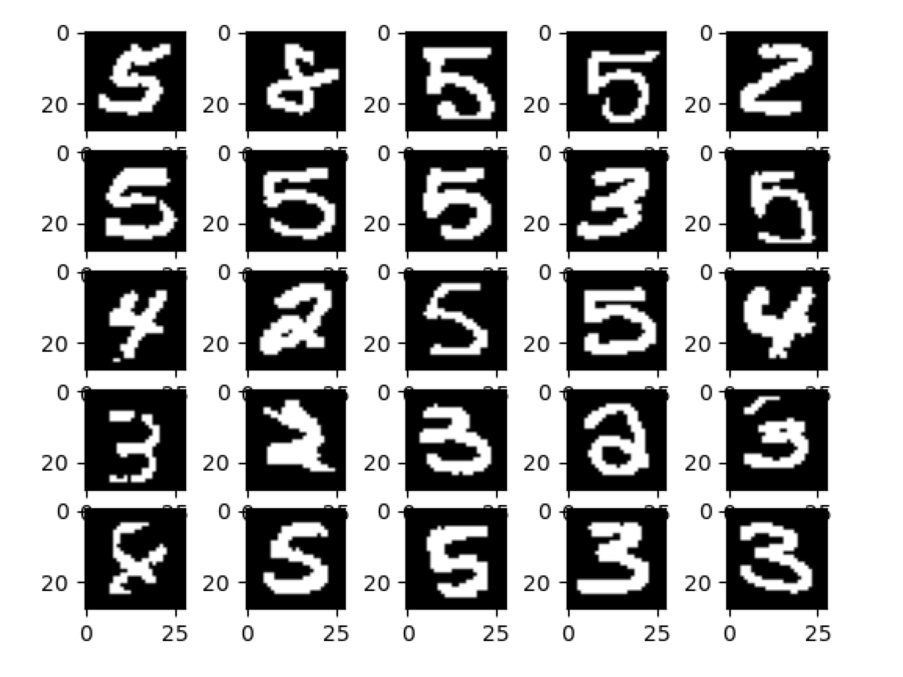
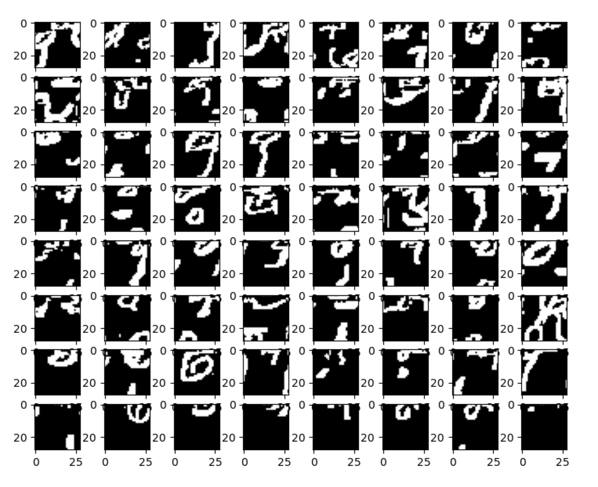

MNIST-grams
=============================

In this project, we build a large n-gram language model of the binarized MNIST data set, and examine its properties, 
and learn some lessons. We consider a binarized MNIST image as a sequence of "1"'s and "0"'s, formed from the 
image's pixels in left-to-right and top-to-bottom fashion. A corpus of sentences is formed, where each "sentence" 
consists of this flattened image representation. The corpus is used to create the n-gram language model.

Create the MNIST binarized corpus:
```
$ python bin/create_mnist_corpus.py
```

Train a 60-gram KenLM language model on the corpus:
```
$ ./train_kenlm.sh 60 out/mnist_corpus.txt out/kenlm mnist_binarized
```
_(NOTE: this assumes KenLM is installed, with a max order of 60, and its binaries are on the Path; the generated KenLM 
model files for this 60-gram LM can total ~8 GB)_

Score an MNIST image and an image randomly sampled from the space of binary-valued pixels:
```
$ python bin/score_image_with_lm.py
```
The MNIST image should have a score of ~-50 while the random image should have a score of ~-425, as one would expect.

Plot a histogram of the scores for all images of the MNIST dataset:
```
$ python bin/histogram_score_with_lm.py
```



...and render the bottom 25 images:



The 25 lowest-scoring images represent the most improbable images in the dataset. The most probable images (not shown) 
consisted mostly of the digit "1", a phenomenon seen in other studies as well.

Sample 1,000 images, pixel-by-pixel, using the LM, and render the top 64 scoring (i.e. most probable) images:
```
$ python bin/sample_image_from_lm.py
```  



Clearly, the generated images are not very faithful representatives of the MNIST images. There are some hints of 
structure in the generated samples, and some arguably contain discernible digits. But trying to model the digits in the 
full 784-dimensional space in which they are embedded appears to be yield inferior results. Indeed, attempting to 
model a lower-dimensional manifold on which the digits reside would be more fruitful.
